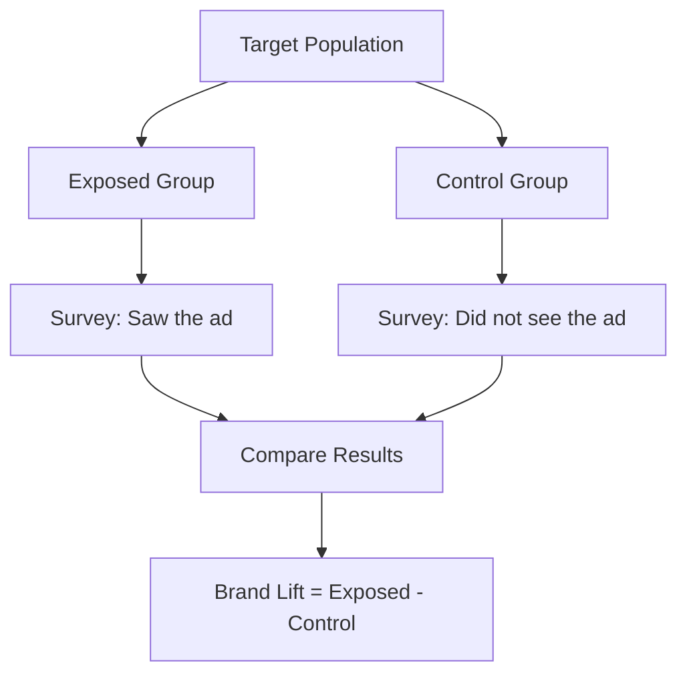

## What is brand lift?

Brand lift measures the incremental impact of advertising on consumer perception. By comparing survey responses from people who saw an ad (exposed group) versus people who didn't (control group), Upwave quantifies how much an ad campaign moved key brand metrics.

## Key metrics

<CardGroup cols={2}>
  <Card title="Awareness" icon="eye">
    "Have you heard of this brand?" Measures whether advertising increased the
    percentage of people who recognize the brand.
  </Card>
  <Card title="Favorability" icon="heart">
    "How favorable is your opinion of this brand?" Tracks shifts in positive
    sentiment toward the brand.
  </Card>
  <Card title="Consideration" icon="cart-shopping">
    "Would you consider purchasing from this brand?" Measures movement along
    the purchase funnel.
  </Card>
  <Card title="Intent" icon="bullseye">
    "How likely are you to purchase?" The strongest signal of downstream
    business impact.
  </Card>
</CardGroup>

## How it works

### Exposed vs. control methodology

The core methodology:

1. **Exposure tracking**: Campaign Manager records which users were served an ad impression via ad server integration (CM360).
2. **Survey distribution**: Both exposed and control users receive identical brand perception surveys.
3. **Statistical analysis**: The Analysis Pipeline computes the difference in positive response rates between groups, applying statistical significance testing.

### Statistical significance

Upwave uses hypothesis testing to ensure reported lift is real, not random noise.

- **Confidence level**: 90% (configurable per study)
- **Minimum sample size**: Automatically calculated based on expected effect size
- **Methodology**: Two-proportion z-test with continuity correction

<Info>
  Results are flagged as "directional" until they reach statistical significance. The dashboard clearly distinguishes significant from directional results.
</Info>

## Reading the results

A typical brand lift result looks like:

| Metric | Control | Exposed | Lift | Significant? |
|--------|---------|---------|------|-------------|
| Awareness | 42% | 48% | +6pt | Yes |
| Favorability | 31% | 34% | +3pt | Yes |
| Consideration | 18% | 20% | +2pt | Directional |
| Intent | 8% | 9% | +1pt | No |

**Lift** is the absolute percentage point difference between exposed and control groups. A +6pt awareness lift means 6% more of the exposed group reported awareness compared to the control group.

## Demographic breakdowns

Results can be sliced by demographic dimensions:

- **Age**: 18-24, 25-34, 35-44, 45-54, 55+
- **Gender**: Male, Female, Other
- **Region**: DMA-level geographic targeting
- **Frequency**: Number of ad exposures (1x, 2-3x, 4-5x, 6+)

<Tip>
  Frequency analysis helps determine optimal ad exposure -- often there's a
  point of diminishing returns where additional impressions stop producing
  incremental lift.
</Tip>

## Related

<CardGroup cols={2}>
  <Card title="Campaigns" icon="bullhorn" href="/guides/campaigns">
    Set up and manage brand lift studies.
  </Card>
  <Card title="Platform overview" icon="sitemap" href="/guides/platform-overview">
    Understand the services behind the analysis.
  </Card>
</CardGroup>
