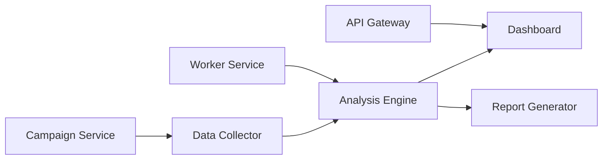

## System architecture

Acme Analytics is built as a collection of microservices, each responsible for a distinct part of the campaign measurement pipeline.



## Services

<AccordionGroup>
  <Accordion title="API Gateway" icon="server">
    The primary backend API. Routes requests to downstream services and handles authentication.

    - **Port**: 8080
    - **Run**: `./gradlew bootRun`
  </Accordion>

  <Accordion title="Campaign Service" icon="plus">
    Handles campaign creation and configuration. Users define study parameters, survey questions, and targeting criteria here.

    - **Run**: `python -m campaign_service.main`
  </Accordion>

  <Accordion title="Data Collector" icon="database">
    Ingests data from external sources (ad servers, survey platforms) and normalizes it for analysis.

    - **Run**: `python -m collector.main`
  </Accordion>

  <Accordion title="Analysis Engine" icon="chart-mixed">
    Runs statistical analysis on collected data. Produces metrics like lift, significance, and demographic breakdowns.

    - **Run**: `pytest -n auto tests/`
  </Accordion>

  <Accordion title="Report Generator" icon="wand-magic-sparkles">
    Produces summary reports and slide decks from analysis results.

    - **Run**: `python -m report_generator.main`
  </Accordion>

  <Accordion title="Dashboard" icon="gauge">
    The web application where users view campaign results, manage studies, and export data.

    - **Run**: `npm run dev`
  </Accordion>
</AccordionGroup>

## Data flow

| Stage | Input | Output |
|-------|-------|--------|
| Collection | Ad server events, survey responses | Normalized event records |
| Analysis | Normalized events | Lift metrics, significance scores |
| Reporting | Lift metrics | Dashboards, slide decks, CSV exports |

## Authentication

API clients authenticate via Bearer tokens.

```bash
curl -H "Authorization: Bearer $TOKEN" \
  https://api.example.com/v1/campaigns
```

## Infrastructure

- **Cloud**: AWS
- **Orchestration**: Kubernetes
- **CI/CD**: GitHub Actions
- **Containers**: Docker Compose for local development
