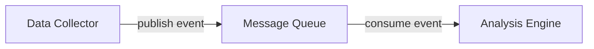

## ADR format

Each decision follows a lightweight format: context, decision, and consequences.

---

## ADR-001: Microservices over monolith

**Date**: 2024-01-15
**Status**: Accepted

### Context

The initial prototype was a single application handling campaign creation, data ingestion, analysis, and reporting. As the team grew, deployments became risky and slow since any change required redeploying everything.

### Decision

Split the application into domain-aligned microservices:
- Campaign Service (campaign CRUD)
- Data Collector (external data ingestion)
- Analysis Engine (statistical computation)
- Report Generator (output formatting)
- API Gateway (routing and auth)

### Consequences

- **Positive**: Independent deployment cycles, team autonomy, fault isolation
- **Negative**: Operational complexity, need for service discovery, distributed tracing

---

## ADR-002: Event-driven data pipeline

**Date**: 2024-03-22
**Status**: Accepted

### Context

The Analysis Engine needs to process data as it arrives from the Data Collector. Initially we used synchronous HTTP calls, which caused cascading failures when the Analysis Engine was under load.

### Decision

Introduce a message queue between the Data Collector and Analysis Engine. Events are published when new data arrives; the Analysis Engine consumes them at its own pace.

### Consequences

- **Positive**: Decoupled services, natural backpressure, replay capability
- **Negative**: Eventual consistency, harder to debug end-to-end, new infrastructure dependency

---

## ADR-003: Password-protected internal docs

**Date**: 2026-02-09
**Status**: Accepted

### Context

We needed a place to document internal procedures (runbooks, architecture decisions) alongside our public documentation. Maintaining a separate wiki was creating drift between public and internal docs.

### Decision

Use Mintlify's partial authentication feature to create a password-protected "Internal" section within the same docs site. Public sections are marked with `"public": true` in `docs.json`; the Internal group omits this flag and requires authentication.

### Consequences

- **Positive**: Single docs site, consistent tooling, easy cross-linking
- **Negative**: Requires Pro plan for password auth, shared password (no individual access control)
